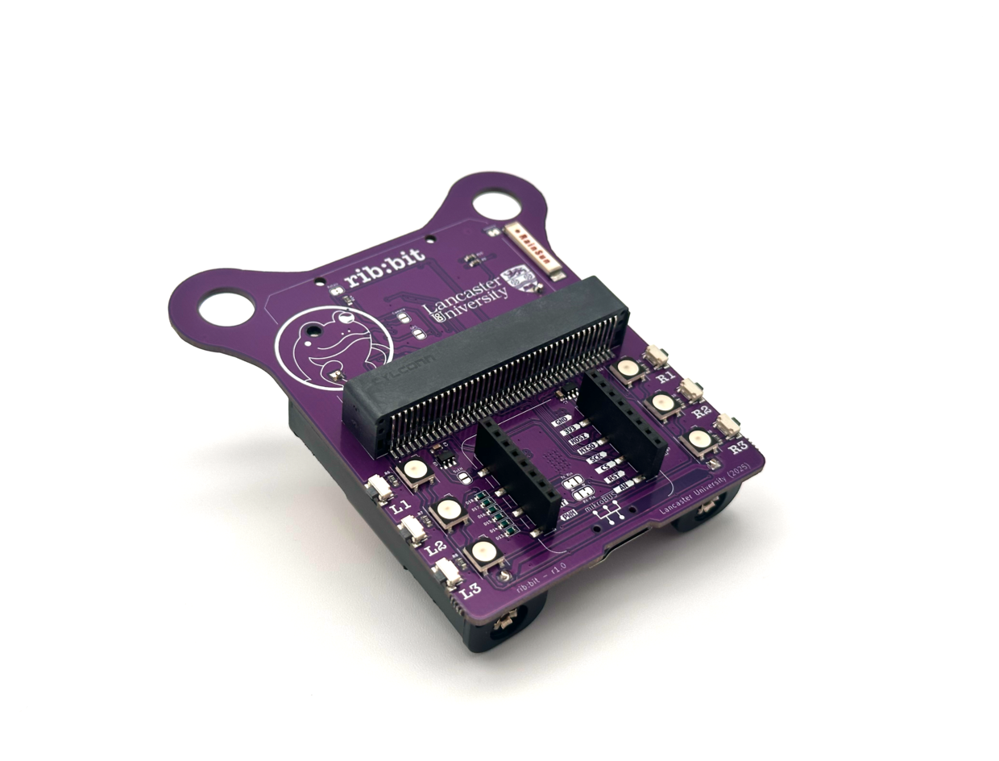
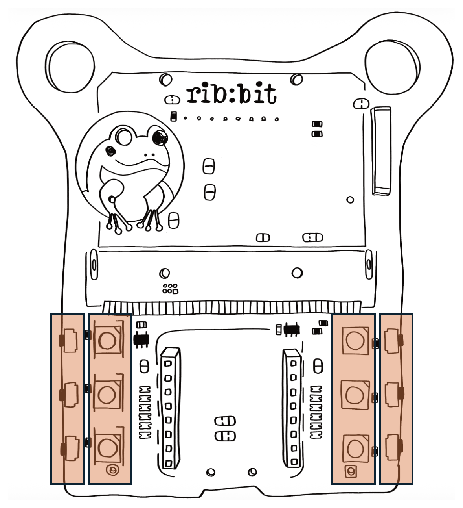
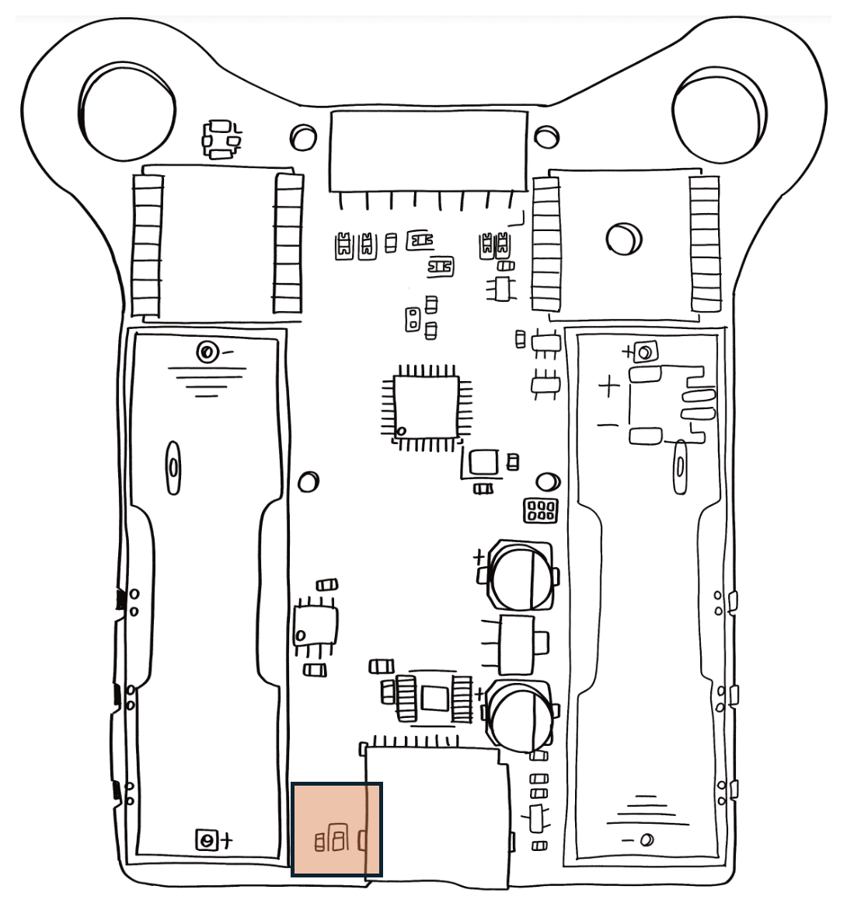

# Overview

<figure>
    
</figure>

## Buttons and LEDs

<figure>
    
</figure>

The Rib:bit has 6 outward-facing buttons, and 6 neopixel full-colour LEDs on its front side, arranged along the lower left and right sides. These are named L1, L2, and L3 on the left side, and correspondingly R1, R2 and R3 on the right.

<figure>
    
</figure>

On the underside near the bottom is a single additional red LED which indicates that the micro-SD card is being accessed. Removing the micro-SD card while this LED is lit can cause loss or corruption of the data on the card, so try to power down the Rib:bit or ensure that your code has a mode where no writes are taking place to allow safe removal.

## Microbit Socket

## MikroBUS Port

## Long Range (LoRa) Radio

## GPS Location Module

## Micro SD Card