> This documentation is still evolving, and some details may be changed in later releases.

# Overview

The rib:bit (AKA Research Innovation Badge) is a leap forward in research technology. It provides a ribbiting opportunity to democratise research by enabling data collection in 'real-world' environments, outside traditional laboratory settings. Anyone can hop into the role of research maker by inserting their micro:bit into the rib:bit and taking advantage of addition features including: real time data logging, location monitoring, and high amounts of data storage on SD cards.

<figure>
    
    <caption>The Rib:bit in all its amphibian glory</caption>
</figure>

The badge is battery powered, meaning it can collect data in different habitats. rib:bit is luminescent and colour changing, containing 6 buttons and lights that are programmable. At the heart of the rib:bit is the capability to connect a sensor of your choice via the mikroBUS™ port, allowing it to metamorphose into a versatile tool that can answer many research questions.

## Wearing The Rib:bit

<figure class="small left">
    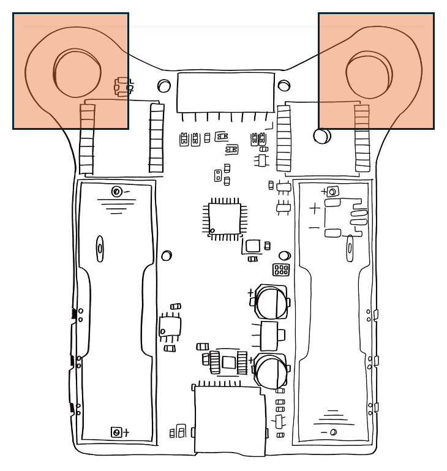
    <caption>The Rib:bit has two large mounting holes through which most types of lanyard clip can be attached.</caption>
</figure>

While its fine to leave the Rib:bit on the desk, where it really shines is when body-worn on a lanyard. To support this we have added two oversize lanyard mounting holes which should handle most types of lanyard clip.

## Powering your rib:bit

<figure class="small left">
    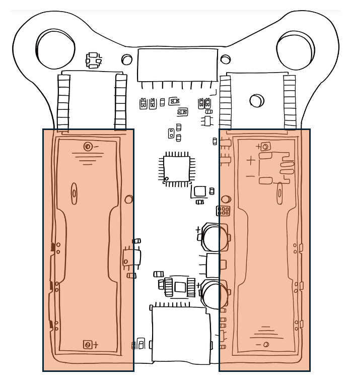
    <caption>Caption Test</caption>
</figure>

There are three ways to power the Rib:bit

1. Through the Micro:bit USB connection
2. From AA batteries
3. From the 2mm JST connector with LiPoly battery packs

The AA batteries and JST connector are mutually exclusive, and as such cannot be used together. It is also worth noting that the Rib:bit _does not_ charge either cell types, so an external charger will have to be used for rechargable batteries. The Rib:bit comes supplied with two single-cell AA battery holders and one 2mm JST connector and once soldered on, these prevent the use of the other type.

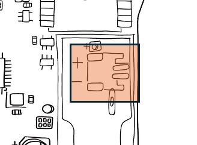

## Buttons and LEDs

<figure class="small right">
    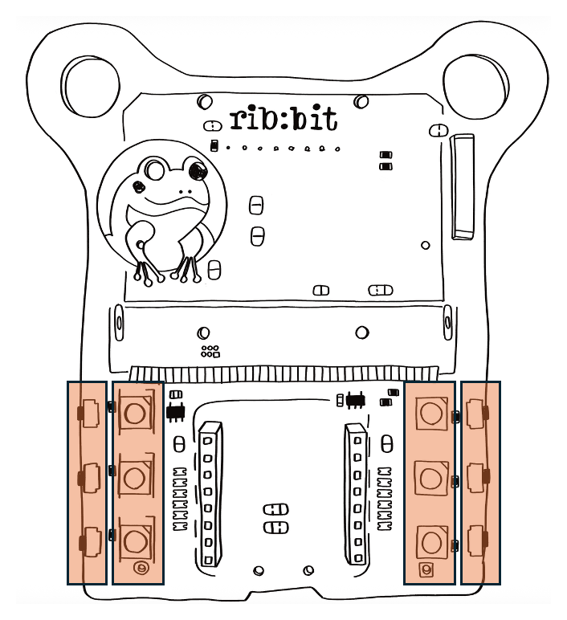
    <caption>Caption Test</caption>
</figure>

The Rib:bit has 6 outward-facing buttons, and 6 neopixel full-colour LEDs on its front side, arranged along the lower left and right sides. These are named L1, L2, and L3 on the left side, and correspondingly R1, R2 and R3 on the right.

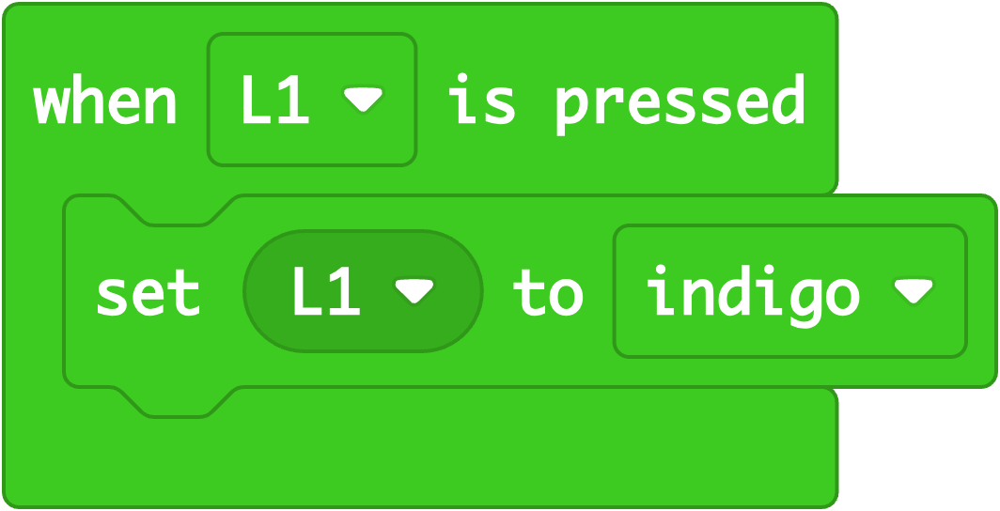

## Microbit Socket

<figure class="small left">
    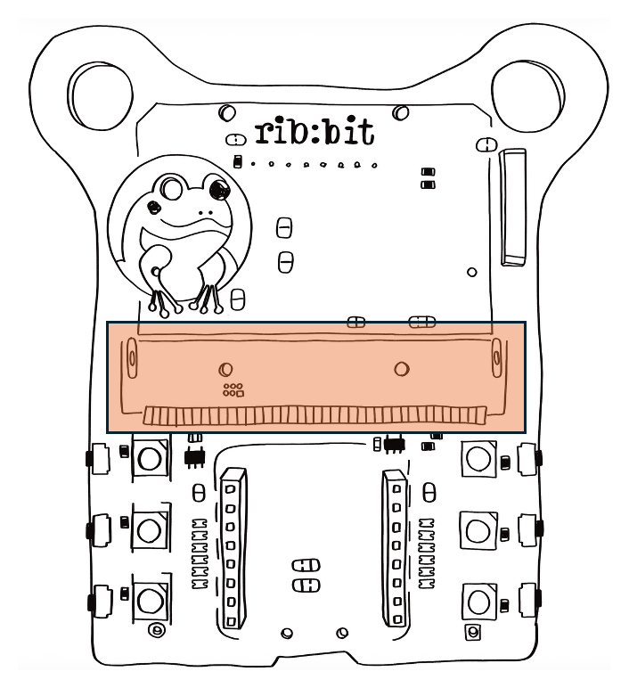
    <caption>The standard Micro:bit port on the Rib:bit.</caption>
</figure>

## MikroBUS Port

<figure class="small right">
    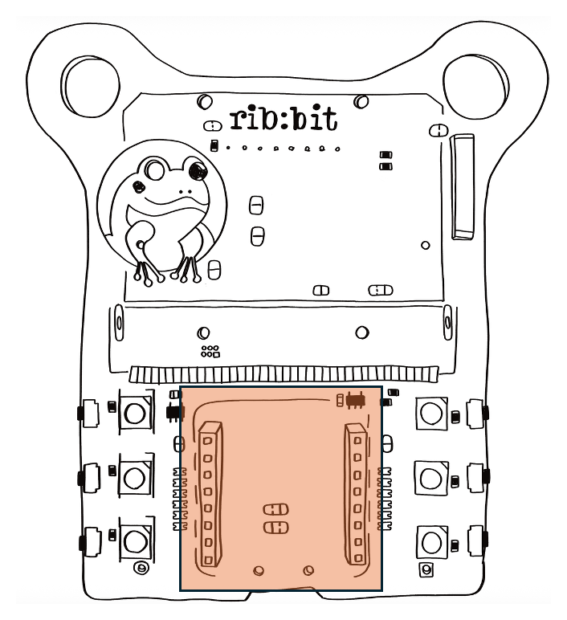
    <caption>The mikroBUS™ port on the Rib:bit is fully featured, including 3v3 and 5v0 power!</caption>
</figure>

## Long Range (LoRa) Radio

<figure class="small left">
    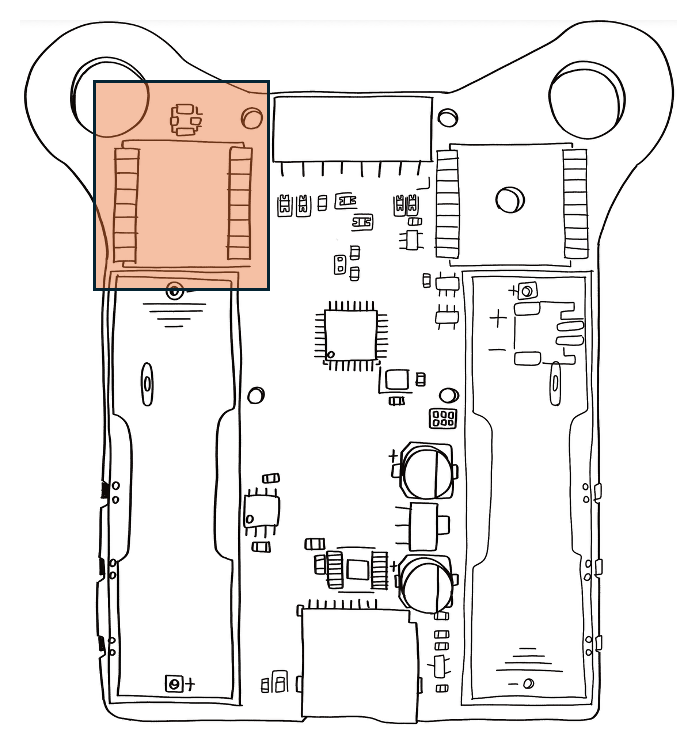
    <caption>Caption Test</caption>
</figure>

## GPS Location Module

<figure class="small right">
    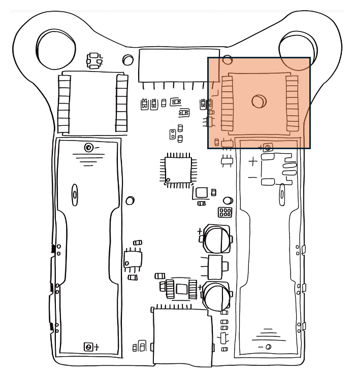
    <caption>Caption Test</caption>
</figure>

Explore ‘where’ things are happening with the GPS Location module. For example, are people more active in urban or rural settings? You can also learn about different environments, by logging how sensor values change from place to place. Some environments might be noisy, whilst others quiet. 

## Micro SD Card

<figure class="small">
    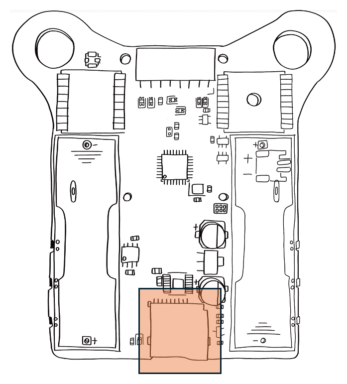
    <caption>Caption Test</caption>
</figure>

microSD cards provide a compact way to collect and store data over long periods of time, or at high resolutions. Want to collect sensor information several times a second, across several hours? You are no longer limited to the flash memory available in the micro:bit! You can explore the data you have selected by placing the microSD card into a microSD port that is connected to your computer. 

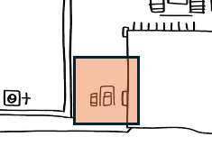

On the underside near the bottom is a single additional red LED which indicates that the micro-SD card is being accessed. Removing the micro-SD card while this LED is lit can cause loss or corruption of the data on the card, so try to power down the Rib:bit or ensure that your code has a mode where no writes are taking place to allow safe removal.

